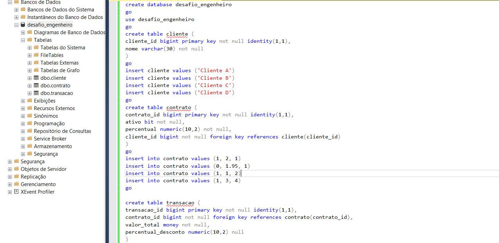

# Teste técnico - Engenheiro de dados GCP

O teste técnico fornecido consiste na realização de 4 tarefas, todas envolvendo dados, tendo como cenário: você é a pessoa engenheira de dados por trás do projeto de DataOps junto a uma grande operadora de cartões de crédito. Os dados a serem ingeridos e analisados em nossa plataforma de Big Data são dados de compras (trasação), documentos (contrato) e dados de compradores (cliente). Seguem as 4 tarefas:

1) Confeccione uma consulta que calcule o ganho total da empresa, o qual é obtido a partir da taxa administrativa do serviço de cartão de crédito para seus clientes. Esse ganho é calculado sobre um percentual das transações de cartão de crédito realizadas por eles. O cálculo é baseado no conjunto de dados fornecido pelo repositório do teste técnico e ilustrado na imagem abaixo:

3) A segunda tarefa consiste em calcular o total líquido da empresa, sendo esse total obtido pelo seguinte cálculo: total_liquido = soma(total_bruto – desconto_percentual). O cálculo é baseado no mesmo conjunto de dados da tarefa anterior, fornecido pelo repositório do teste técnico e deve ser feita com um código em Pyspark.

4) A terceira tarefa consiste na transformação de dados disponíveis em arquivo Json para o formato de dataframe. Após transformar esse Json em dataframe, é possível perceber que a coluna "item_list" está como dicionário. Seu gestor pediu dois pontos de atenção nessa tarefa:

   - Expandir a coluna num mesmo dataframe;
   - Normalizar os itens dessa coluna de dicionário e dividí-los em dois dataframes separados, seguindo o modelo relacional.

5) Imagine que o Json das notas fiscais é disponibilizado em uma API. Como você utilizaria as tecnologias da GCP para ingerir, transformar e, eventualmente, carregar esses dados em um BigTable? A quarta tarefa consiste na construção de uma arquitetura de ingestão dos dados de nota fiscal, a qual deve atender aos seguintes pontos:

   - Esquemas de fluxo de dados;
   - Descrições de funcionamento (se necessário);
   - Nomes de tecnologias em ecossistema GCP (serviços, conectores, bibliotecas e módulos).
   - Será apreciado como esforço extra se você conseguir avançar mais na aplicação além desse ponto.

Em resumo, o que se deve entregar das tarefas é:
       1) Consulta que retorne o ganho total da empresa por cliente;
       2) Código com pyspark que retorne o total liquido;
       3) Resolução de problema de transformação de dados (NF-e);
       4) Arquitetura exemplo da ingestão anterior (ecossistema GCP).

--------------------------------------------------------------------------------------------------------------------------------------------------------------------

# Resolução:

1) Primeiramente, executamos a Stored Procedure fornecida pelo repositório do desafio, o que nos gera um banco de dados para usarmos de base. Após a execução da Stored Procedure, analisamos o banco de dados que temos em mão para que possamos gerar a melhor consulta possível, para o que a tarefa pede.

Calcularemos o ganho total da empresa através do percentual das transações de cartão de crédito realizadas pelos clientes, baseados na taxa administrativa do serviço de cartão de crédito para eles. Baseia-se o cálculo nos conjuntos de dados "transação", "cliente" e "contrato".
Com essas informações e analisando o banco de dados fornecidos, chegamos na consulta abaixo:

Temos, como resultados da consulta:

O "Cliente B" não aparece no resultado, pois não há transações associadas a contratos ativos para esse cliente no conjunto de dados fornecido.

2) Para a segunda tarefa, analisaremos novamente o banco de dados fornecido pelo repositório do desafio e alinharemos a requisição com o que temos. Nisso, prosseguimos, antes de mais nada, instalando, tanto o Pyspark no sistema, quanto o Pyodbc.

A segunda tarefa consiste em calcular o total líquido da empresa. Esse total é calculado da seguinte forma total_liquido = soma(total_bruto – desconto_percentual). O cálculo é baseado no conjunto de dados da Figura 3

O resultado esperado é uma código com pyspark que retorne o total liquido da empresa que é 59973.46.

3) O primeiro passo para realizarmos a resolução da tarefa 2 é fazermos o upload do arquivo json fornecido pelo repositório do teste técnico. O próximo passo é analisarmos o arquivo json fornecido, de nome "data.json".
Agora, carregamos o arquivo "data.json" em um dataframe utilizando a biblioteca Python chamada Pandas. Começamos importando a biblioteca e dando um "apelido" para a mesma, sendo ele "pd", para facilitar a "chamada" de tal biblioteca durante todo o seu uso. Depois, expandimos a columa "ItemList", pois a mesma contém dicionários. Iremos expandí-la no mesmo dataframe.
O passo seguinte consiste em nortamizar os itens da coluna "ItemList" e dividir os mesmos em dois dataframes distintos, seguindo o modelo relacional. Seguiremos assim: o dataframe "df_nfe_details' contéra os detalhes da nota fiscal e o dataframe "df_items" conterá os itens da nota fiscal. Segue o código explicado, no formato de um notebook do Jupyter Notebook:

<a href="json_to_df.Ipynb">Noteboof</a>.

4) O primeiro passo é entender bem o que foi proposto, sendo que consiste numa arquitetura de Fluxo de Dados (ETL), feito no ecossistema de computação em nuvem Google Cloud Platform, com os dados brutos sendo notas fiscais, provenientes de uma API externa à plataforma do GCP. Segue a arquitetura proposta:
  

Resumidamente, uma Cloud Function consulta periodicamente a API de Notas Fiscais e envia os dados para o Cloud Pub/Sub que, por sua vez, publica os dados para o Cloud Dataflow que processa e transforma os dados, seguindo os parâmetros estabelecidos pelo cliente e pelo bom senso do engenheiro de dados. E, após finalizada a etapa do Cloud Dataflow, os dados são carregados no Cloud Bigtable.

Algumas sugestões para melhorar e otimizar o fluxo de dados anterior seriam:

   - Pode-se utilizar as ferramentas de IAM da GCP para aumentar a segurança da transferência de dados e também utilizar hierarquia de acessos para os funcionários que utilizaríam das ferramentas e dados do projeto;
   - Pode-se implementar o Cloud Monitoring para monitorar o desempenho do fluxo e do sistema como um todo;
   - Pode-se implementar o Cloud Logging para registrar o desempenho do fluxo e do sistema como um todo.
